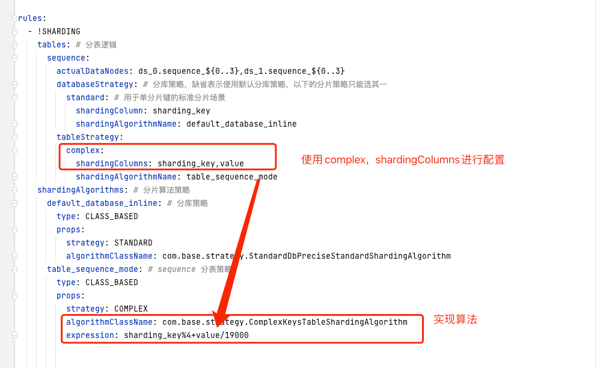
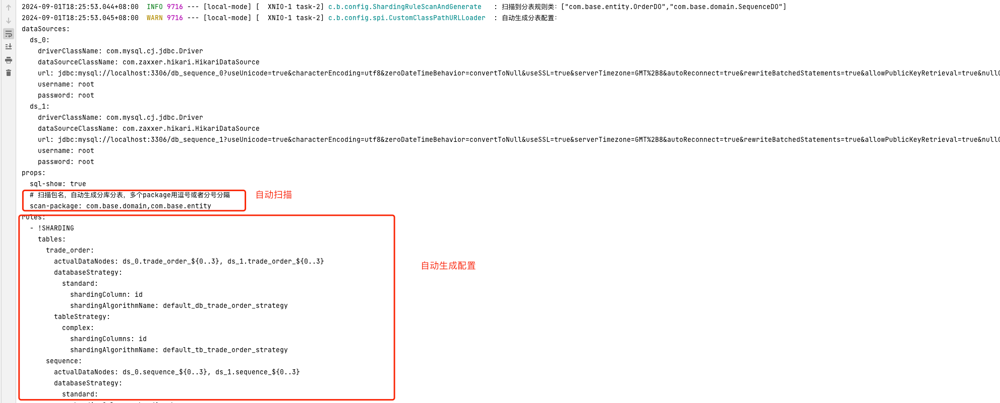

# shardingsphere-5.5.0-example
   ### 参考官网：https://shardingsphere.apache.org/

--------
# 背景
>  由于网上对于springboot3.x集成的shardingsphere-5.5.0版本，都是基于本地数据源配置，而我们在实际生产
   中，都是基于远程配置中心，本地配置如：jdbc:shardingsphere:classpath:sharding.yaml。然而这种方式不能满足企业级应用开发
   ，于是，我这里做了一个集成工程，解决这些配置问题。

### 解决问题： 
1.远程配置：通过实现SPI方式，基于nacos配置中心，进行远程数据源配置，实现读写分离，分库分表。

2.去除配置：由于每次配置分库分表，配置文件非常多，非常麻烦，于是我在这些编写了一个自动扫描包，
  自动生成配置文件功能，实现自动扫描包，注解自动生成配置文件，大大减少了配置工作。
   
#  我只是雷锋，欢迎大家提出意见，欢迎大家提pr

# 集成工程
#### springboot3.x + shardingsphere-5.5.0 + nacos-2.3.0 + mybatis-plus

#### 运行环境：jdk17/jdk21 + mysql8.0

## 工程结构

      shardingsphere5-example
      |- example-common  常用的mybatis-plus
      |- local-mode-5.5.0  本地配置模式
      |- nacos-mode-5.5.0  nacos配置模式

      dependencies 
      |-parent.pom  maven工程父依赖文件
      |- scripts
         |- 数据库脚本


#### springboot3.x集成web启动方式这里就不过多介绍，直接看代码，这里主要是介绍如何引入shardingsphere-5.5.0如何配置


# shardingsphere5.X 配置

shardingsphere5.X方式与4.x以前以往不一样，shardingsphere5.X使用了原生的org.apache.shardingsphere.driver.ShardingSphereDriver，
使用spring.datasource.url=jdbc:shardingsphere:classpath:sharding.yaml方式引入数据源和分库分表配置，如下：

[sharding.yaml](local-mode-5.5.0%2Fsrc%2Fmain%2Fresources%2Fsharding.yaml)

````yaml
dataSources:
  ds_0:
    driverClassName: com.mysql.cj.jdbc.Driver
    dataSourceClassName: com.zaxxer.hikari.HikariDataSource
    url: jdbc:mysql://localhost:3306/db_sequence_0?useUnicode=true&characterEncoding=utf8&zeroDateTimeBehavior=convertToNull&useSSL=true&serverTimezone=GMT%2B8&autoReconnect=true&rewriteBatchedStatements=true&allowPublicKeyRetrieval=true&nullCatalogMeansCurrent=true
    username: root
    password: root
  ds_1:
    driverClassName: com.mysql.cj.jdbc.Driver
    dataSourceClassName: com.zaxxer.hikari.HikariDataSource
    url: jdbc:mysql://localhost:3306/db_sequence_1?useUnicode=true&characterEncoding=utf8&zeroDateTimeBehavior=convertToNull&useSSL=true&serverTimezone=GMT%2B8&autoReconnect=true&rewriteBatchedStatements=true&allowPublicKeyRetrieval=true&nullCatalogMeansCurrent=true
    username: root
    password: root
props:
  sql-show: true


rules:
  - !SHARDING
    tables:
      sequence:
        actualDataNodes: ds_0.sequence_${0..3},ds_1.sequence_${0..3}
        databaseStrategy: # 分库策略，缺省表示使用默认分库策略，以下的分片策略只能选其一
          standard: # 用于单分片键的标准分片场景
            shardingColumn: sharding_key
            shardingAlgorithmName: database_inline
        tableStrategy:
          standard:
            shardingColumn: sharding_key
            shardingAlgorithmName: table_inline
    shardingAlgorithms:
      database_inline: # 分库策略
        type: CLASS_BASED
        props:
          strategy: STANDARD
          algorithmClassName: com.base.strategy.StandardDbPreciseStandardShardingAlgorithm
      table_inline: # 分表策略
        type: CLASS_BASED
        props:
          strategy: STANDARD
          algorithmClassName: com.base.strategy.StandardTablePreciseStandardShardingAlgorithm
````


### 本地配置模式 local-mode-5.5.0
   结构如下图：
   
   
   本地模式配置比较简单，[application.yaml](local-mode-5.5.0%2Fsrc%2Fmain%2Fresources%2Fapplication.yaml)

````yaml
server:
  port: 8088
  servlet:
    context-path: /
    encoding:
      force-response: true

spring:
  profiles:
    active: dev
  main:
    allow-bean-definition-overriding: true
  application:
    name: local-mode
  datasource:
    driver-class-name: org.apache.shardingsphere.driver.ShardingSphereDriver
    url: jdbc:shardingsphere:classpath:sharding.yaml
  servlet:
    multipart:
      max-file-size: 100MB
      max-request-size: 100MB


# MyBatisPlus配置
# https://baomidou.com/config/
mybatis-plus:
  # 多包名使用 例如 com.base.**.mapper,org.xxx.**.mapper
  mapperPackage: com.base.**.mapper
  # 对应的 XML 文件位置
  mapperLocations: classpath*:mapper/**/*Mapper.xml
  # 实体扫描，多个package用逗号或者分号分隔
  typeAliasesPackage: com.base.**.domain
  global-config:
    dbConfig:
      # 主键类型
      # AUTO 自增 NONE 空 INPUT 用户输入 ASSIGN_ID 雪花 ASSIGN_UUID 唯一 UUID
      # 如需改为自增 需要将数据库表全部设置为自增
      idType: ASSIGN_ID

````

核心的配置在于： 

````
spring:
  datasource:
    driver-class-name: org.apache.shardingsphere.driver.ShardingSphereDriver
    url: jdbc:shardingsphere:classpath:sharding.yaml
````

  通过jdbc:shardingsphere:classpath:sharding.yaml方式引入数据源和分库分表配置

### nacos配置模式 nacos-mode-5.5.0
> 我们尝试使用nacos配置中心，实现远程配置，实现读写分离，分库分表。结构如下图：


> 直接看配置：
* 这里是本地配置文件
[bootstrap.yaml](nacos-mode-5.5.0%2Fsrc%2Fmain%2Fresources%2Fbootstrap.yaml)
````yaml
nacos:
  namespace: ecommerce-local
  group: MALL_GROUP
  service-address: 192.168.8.166:8848
  username: nacos
  password: nacos

spring:
  profiles:
    active: local
  application:
    name: nacos-mode
  main:
    allow-circular-references: true
    allow-bean-definition-overriding: true
  cloud:
    nacos:
      config:
        server-addr: ${nacos.service-address}
        file-extension: yaml
        namespace: ${nacos.namespace}
        group: ${nacos.group}
        username: ${nacos.username}
        password: ${nacos.password}
      discovery:
        server-addr: ${nacos.service-address}
        namespace: ${nacos.namespace}
        group: ${nacos.group}
        username: ${nacos.username}
        password: ${nacos.password}
  datasource:
    driver-class-name: org.apache.shardingsphere.driver.ShardingSphereDriver
    url: jdbc:shardingsphere:nacos:sharding.yaml?serverAddr=${nacos.service-address}&namespace=${nacos.namespace}&group=${nacos.group}&username=${nacos.username}&password=${nacos.password}
````

> nacos 配置中心有两个文件
* 1.项目配置：nacos-mode.yaml
````yaml
server:
  port: 8088
  servlet:
    context-path: /
    encoding:
      force-response: true

# spring 配置
spring:
  servlet:
    multipart:
      max-file-size: 100MB
      max-request-size: 100MB

# MyBatisPlus配置
# https://baomidou.com/config/
mybatis-plus:
  # 多包名使用 例如 com.base.admin.**.mapper,org.xxx.**.mapper
  mapperPackage: com.base.**.mapper
  # 对应的 XML 文件位置
  mapperLocations: classpath*:mapper/**/*Mapper.xml
  # 实体扫描，多个package用逗号或者分号分隔
  typeAliasesPackage: com.base.**.domain
  global-config:
    dbConfig:
      # 主键类型
      # AUTO 自增 NONE 空 INPUT 用户输入 ASSIGN_ID 雪花 ASSIGN_UUID 唯一 UUID
      # 如需改为自增 需要将数据库表全部设置为自增
      idType: ASSIGN_ID
````

* 2.远程nacos数据源/分库分表配置：[sharding.yaml](local-mode-5.5.0%2Fsrc%2Fmain%2Fresources%2Fsharding.yaml)

> 本地配置url: jdbc:shardingsphere:classpath:sharding.yaml;
> 这里唯一不同把配置改为了url: jdbc:shardingsphere:nacos:sharding.yaml?serverAddr=${nacos.service-address}&namespace=${nacos.namespace}&group=${nacos.group}&username=${nacos.username}&password=${nacos.password}

# ShardingSphereURLLoader 实现配置
> 通过观察，classpath:sharding.yaml实现的是从项目路径加载sharding.yaml，而我们可以设想是否可以定义nacos:sharding.yaml，则通过nacos配置中心加载的。

* 1.于是通过阅读ShardingSphere源码，发现classpath:是通过集成ShardingSphereURLLoader实现（ClassPathURLLoader）SPI来加载本地的sharding.yaml，于是我们则参考实现ClassPathURLLoader
来实现CustomNacosURLLoader，从而达到nacos配置中心加载sharding.yaml的目的。

* 2.实现SPI：[CustomNacosURLLoader.java](nacos-mode-5.5.0%2Fsrc%2Fmain%2Fjava%2Fcom%2Fbase%2Fspi%2FCustomNacosURLLoader.java)
````java
package com.base.spi;

import com.alibaba.nacos.api.NacosFactory;
import com.alibaba.nacos.api.common.Constants;
import com.alibaba.nacos.api.config.ConfigService;
import com.alibaba.nacos.shaded.com.google.common.base.Preconditions;
import lombok.SneakyThrows;
import org.apache.shardingsphere.infra.url.spi.ShardingSphereURLLoader;

import java.util.Properties;

/**
 * @title: CustomNacosURLLoader
 * @description: 实现SPI，读取远程的nacos配置
 * @author: arron
 * @date: 2024/8/28 22:09
 */
public class CustomNacosURLLoader implements ShardingSphereURLLoader {

    /**
     * 定义jdbc:shardingsphere:后的类型为nacos:
     */
    private static final String NACOS_TYPE = "nacos:";

    /**
     * 接收nacos:后的参数sharding.yaml?serverAddr=${nacos.service-address}&namespace=${nacos.namespace}&group=${nacos.group}&username=${nacos.username}&password=${nacos.password}
     * @param configurationSubject configuration dataId
     * @param queryProps url参数，已经解析成为Properties
     * @return
     */
    @Override
    @SneakyThrows
    public String load(String configurationSubject, Properties queryProps) {
        ConfigService configService = NacosFactory.createConfigService(queryProps);
        String dataId = configurationSubject;
        //获取nacos配置
        String config = configService.getConfig(dataId, queryProps.getProperty(Constants.GROUP, Constants.DEFAULT_GROUP), 500);
        Preconditions.checkArgument(config != null, "Nacos config [" + dataId + "] is Empty.");
        return config;
    }

    @Override
    public Object getType() {
        return NACOS_TYPE;
    }
}
````

* 3.声明SPI：在项目的resources目录下创建：META-INF/services/org.apache.shardingsphere.infra.url.spi.ShardingSphereURLLoader
  并且添加内容：com.base.spi.CustomNacosURLLoader（SPI 实现类）

---
# 测试：
````
http://localhost:8088/list?shardingKey=1
````


# 自定义分库分表参数

## 1.自定义配置：


````yaml
       sequence_mode: # sequence 分表策略
        type: CLASS_BASED
        props:
          strategy: STANDARD
          algorithmClassName: com.base.strategy.StandardTablePreciseStandardShardingAlgorithm
          expression: SHARDING_KEY%4*8+SHARDING_KEY*2+SHARDING_KEY/8 #自定义分表公式
````


## 2.实现类添加初始化方法，接受自定义参数
````java
/**
 * @title: 分表策略
 * @description: 精确分表算法
 * @author: arron
 * @date: 2024/8/25 11:57
 */
public class TablePreciseShardingAlgorithm implements StandardShardingAlgorithm<Long> {

    /**
     * 默认常量
     */
    private static String SHARDING_KEY = "SHARDING_KEY";

    /**
     * 自定义参数
     */
    private Properties properties;

    @Override
    public void init(Properties properties) {
        this.properties = properties;
    }

    /**
     * 计算分表
     *
     * @param preciseShardingValue
     * @return
     */
    private int getShardingValue(long preciseShardingValue) {
        String expression = properties.getProperty("expression");
        String expressionStr = expression.replace(SHARDING_KEY, String.valueOf(preciseShardingValue));
        // 执行计算
        int value = ExpressionEvaluator.evaluateExpression(expressionStr);
        return value;
    }

    @Override
    public String doSharding(Collection<String> tables, PreciseShardingValue<Long> preciseShardingValue) {
        int value = getShardingValue(preciseShardingValue.getValue().longValue());

        String tableName = null;
        for (String table : tables) {
            if (table.endsWith(String.valueOf(value))) {
                tableName = table;
                break;
            }
        }
        if (StringUtils.isBlank(tableName)) {
            throw new IllegalArgumentException("根据 sharding_key取模 分表策略获取表名错误");
        }
        return tableName;
    }

    @Override
    public Collection<String> doSharding(Collection<String> tables, RangeShardingValue<Long> rangeShardingValue) {
        int size = tables.size();
        Set<String> result = new LinkedHashSet<>();
        // between and 的起始值
        long lower = rangeShardingValue.getValueRange().lowerEndpoint();
        long upper = rangeShardingValue.getValueRange().upperEndpoint();
        // 循环范围计算分库逻辑
        for (long i = lower; i <= upper; i++) {
            for (String table : tables) {
                if (table.endsWith(String.valueOf(i % size))) {
                    result.add(table);
                }
            }
        }
        return result;
    }
}

````


# 多字段分库策略

1. 实现ComplexKeysShardingAlgorithm进行多字段分库分表
````java
/**
 * @title: AbsComplexKeysShardingAlgorithm
 * @description: 组合键分库分表
 * @author: arron
 * @date: 2024/9/1 10:34
 */
@Slf4j
public abstract class AbsComplexKeysShardingAlgorithm implements ComplexKeysShardingAlgorithm<Long> {
    protected Properties properties;

    @Override
    public void init(Properties properties) {
        this.properties = properties;
    }

    /**
     * 计算分表
     *
     * @param columnNameAndShardingValuesMap
     * @return -1 表示无表达式
     */
    protected int getShardingValue(Map<String, Collection<Long>> columnNameAndShardingValuesMap) {
        String expression = properties.getProperty("expression");
        if (StringUtils.isBlank(expression)) {
            log.error("expression_is_null");
            return -1;
        }
        Set<String> columnNameKeySet = columnNameAndShardingValuesMap.keySet();
        for (String columnName : columnNameKeySet) {
            Object preciseShardingValue = columnNameAndShardingValuesMap.get(columnName).iterator().next();
            expression = expression.replace(columnName, String.valueOf(preciseShardingValue));
        }
        // 执行计算
        int value = ExpressionEvaluator.evaluateExpression(expression);
        return value;
    }

}


/**
 * @title: ComplexKeysTableShardingAlgorithm
 * @description: 复合字段分表策略
 * @author: arron
 * @date: 2024/9/1 10:41
 */
@Slf4j
public class ComplexKeysTableShardingAlgorithm extends AbsComplexKeysShardingAlgorithm {

    @Override
    public Collection<String> doSharding(Collection<String> tables, ComplexKeysShardingValue<Long> complexKeysShardingValue) {
        if (CollectionUtils.isEmpty(tables)) {
            log.error("ComplexKeysTableShardingAlgorithm_tables_is_null");
            throw new IllegalArgumentException("ComplexKeysTableShardingAlgorithm_tables_is_null");
        }
        Collection<String> result = new LinkedHashSet<>();
        String tableName = null;

        if (tables.size() == 1) {
            log.error("ComplexKeysTableShardingAlgorithm_tables_size_is_one");
            tableName = tables.iterator().next();
            result.add(tableName);
            return result;
        }

        Map<String, Collection<Long>> columnNameAndShardingValuesMap = complexKeysShardingValue.getColumnNameAndShardingValuesMap();
        int value = getShardingValue(columnNameAndShardingValuesMap);

        for (String table : tables) {
            if (table.endsWith(String.valueOf(value))) {
                tableName = table;
                result.add(tableName);
                break;
            }
        }

        if (result.isEmpty()) {
            log.error("ComplexKeysTableShardingAlgorithm_tableName_error 根据 sharding_key 取模 分表策略获取表名错误");
            throw new IllegalArgumentException("ComplexKeysTableShardingAlgorithm_tableName_error 根据 sharding_key取模 分表策略获取表名错误");
        }
        return result;
    }
}

````

配置文件：[sharding-complex-bak.yaml](local-mode-5.5.0%2Fsrc%2Fmain%2Fresources%2Fsharding-bak.yaml)


````yaml
rules:
  - !SHARDING
    tables: # 分表逻辑
      sequence:
        tableStrategy:
          complex:
            shardingColumns: sharding_key,value
            shardingAlgorithmName: table_sequence_mode
    shardingAlgorithms: # 分片算法策略
      table_sequence_mode: # sequence 分表策略
        type: CLASS_BASED
        props:
          strategy: COMPLEX
          algorithmClassName: com.base.strategy.ComplexKeysTableShardingAlgorithm
          expression: sharding_key%4+value/19000
````


# 自动配置

> 步骤1：定义一个注解类，把重点的配置做成属性，允许用户进行自定义，如下：
参考类：[ShardingConfig.java](example-common%2Fsrc%2Fmain%2Fjava%2Fcom%2Fbase%2Fconfig%2FShardingConfig.java)

````java
@ShardingConfig(
        shardingColumn = "sharding_key",
        tbAlgorithmsType = ShardingConfigEnums.ShardingAlgorithmType.CLASS_BASED,
        tbStrategy = ShardingConfigEnums.ShardingStrategy.STANDARD,
        tbAlgorithmClassName = "com.base.strategy.StandardTablePreciseStandardShardingAlgorithm",
        tbExpression = "sharding_key%4",
        dbAlgorithmsType = ShardingConfigEnums.ShardingAlgorithmType.CLASS_BASED,
        dbStrategy = ShardingConfigEnums.ShardingStrategy.STANDARD,
        dbAlgorithmClassName = "com.base.strategy.StandardDbPreciseStandardShardingAlgorithm",
        dbExpression = "sharding_key%4",
        tbShardingCount = 4
)
@TableName("sequence")
````


> 步骤2：实现一个扫描器，对package的类进行扫描注解，如下：
[PackageScanner.java](example-common%2Fsrc%2Fmain%2Fjava%2Fcom%2Fbase%2Fconfig%2FPackageScanner.java)

````java
    // 扫描使用了注解@TableName的类
    Set<Class<?>> annotatedClassesInPackage = PackageScanner.getAnnotatedClassesInPackages(packages, TableName.class);
````


> 步骤3：实现一个SPI：[CustomClassPathURLLoader.java](example-common%2Fsrc%2Fmain%2Fjava%2Fcom%2Fbase%2Fconfig%2Fspi%2FCustomClassPathURLLoader.java)，在获取配置时候，对扫描到的类，进行解析，生成配置文件，如下：
定义：custmer-classpath配置，并且定义变量：useAutoConfig，是否使用自动注解配置

````java
/**
 * @title: CustomClassPathURLLoader
 * @description: 实现SPI，读取配置，自动生成配置
 * @author: arron
 * @date: 2024/8/28 22:09
 */
@Slf4j
public class CustomClassPathURLLoader implements ShardingSphereURLLoader {

    /**
     * 定义jdbc:shardingsphere:后的类型为nacos:
     */
    private static final String CUSTOMER_CLASSPATH_TYPE = "custmer-classpath:";

    /**
     * 接收custmer:classpath:
     *
     * @param configurationSubject configuration dataId
     * @param queryProps           url参数，已经解析成为Properties
     * @return
     */
    @Override
    @SneakyThrows
    public String load(String configurationSubject, Properties queryProps) {
        try (InputStream inputStream = Thread.currentThread().getContextClassLoader().getResourceAsStream(configurationSubject)) {
            Objects.requireNonNull(inputStream);
            try (BufferedReader reader = new BufferedReader(new InputStreamReader(inputStream, StandardCharsets.UTF_8))) {
                String config = reader.lines().collect(Collectors.joining(System.lineSeparator()));

                String useAutoConfig = queryProps.getProperty("useAutoConfig");
                if (!StringUtils.isBlank(useAutoConfig) && Boolean.parseBoolean(useAutoConfig)) {
                    config = ShardingRuleScanAndGenerate.generateConfig(config);
                }
                log.warn("自动生成分表配置：\n{}", config);
                return config;
            }
        }
    }


    @Override
    public Object getType() {
        return CUSTOMER_CLASSPATH_TYPE;
    }
}
````

[application.yaml](local-mode-5.5.0%2Fsrc%2Fmain%2Fresources%2Fapplication.yaml)
````yaml 
spring:
  datasource:
    url: jdbc:shardingsphere:custmer-classpath:sharding.yaml?useAutoConfig=true
````

[sharding.yaml](local-mode-5.5.0%2Fsrc%2Fmain%2Fresources%2Fsharding.yaml) 只需要配置数据源信息，其他配置，由用户注解进行配置，如下：

注意，需要对所需要分库分表的类进行扫描：scan-package: com.base.domain,com.base.entity

````yaml
dataSources:
  ds_0:
    driverClassName: com.mysql.cj.jdbc.Driver
    dataSourceClassName: com.zaxxer.hikari.HikariDataSource
    url: jdbc:mysql://localhost:3306/db_sequence_0?useUnicode=true&characterEncoding=utf8&zeroDateTimeBehavior=convertToNull&useSSL=true&serverTimezone=GMT%2B8&autoReconnect=true&rewriteBatchedStatements=true&allowPublicKeyRetrieval=true&nullCatalogMeansCurrent=true
    username: root
    password: root
  ds_1:
    driverClassName: com.mysql.cj.jdbc.Driver
    dataSourceClassName: com.zaxxer.hikari.HikariDataSource
    url: jdbc:mysql://localhost:3306/db_sequence_1?useUnicode=true&characterEncoding=utf8&zeroDateTimeBehavior=convertToNull&useSSL=true&serverTimezone=GMT%2B8&autoReconnect=true&rewriteBatchedStatements=true&allowPublicKeyRetrieval=true&nullCatalogMeansCurrent=true
    username: root
    password: root
props:
  sql-show: true
  # 扫描包名，自动生成分库分表，多个package用逗号或者分号分隔
  scan-package: com.base.domain,com.base.entity

````

> 步骤4：实现组装配置类：[ShardingRuleScanAndGenerate.java](example-common%2Fsrc%2Fmain%2Fjava%2Fcom%2Fbase%2Fconfig%2FShardingRuleScanAndGenerate.java)，
> 利用注解解析出来的配置，进行组装配置，最后由SPI统一返回配置：
````java

/**
 * @title: ShardingRuleScanAndGenerate
 * @description: 启动时候扫描并且生成规则
 * @author: arron
 * @date: 2024/9/1 11:50
 */
@Slf4j
public class ShardingRuleScanAndGenerate {

    /**
     * 利用配置，生成配置
     * @param config
     * @return
     */
    public static String generateConfig(String config) {
        Yaml yaml = new Yaml();
        Map<String, JSONObject> parsedData = yaml.load(config);
        Map<String, JSONObject> dataSources = (LinkedHashMap) parsedData.get("dataSources");
        if (dataSources == null) {
            log.error("no dataSources config");
            throw new RuntimeException("no dataSources config");
        }
        Map<String, String> scanPackages = (LinkedHashMap) parsedData.get("props");
        if (scanPackages == null){
            log.error("no scan-package config");
            throw new RuntimeException("no scan-package config");
        }
        String packages = scanPackages.get("scan-package");
        if (StringUtils.isBlank(packages)){
            log.error("no scan-package ");
            throw new RuntimeException("no scan-package");
        }
        config = config + generateConfig(dataSources, packages);
        return config;
    }

    public static String generateConfig(Map<String, JSONObject> dataSources, String packages) {
        Set<Class<?>> annotatedClassesInPackage = PackageScanner.getAnnotatedClassesInPackages(packages, TableName.class);
        log.info("扫描到分表规则类：{}", JSONObject.toJSONString(annotatedClassesInPackage));
        String space2 = "  ";

        StringBuffer sb = new StringBuffer();
        sb.append("\n");
        sb.append("rules:").append("\n");
        sb.append(space2).append("- !SHARDING").append("\n");
        sb.append(space2).append(space2).append("tables:").append("\n");

        //TODO 生成分片规则
        for (Class<?> clazz : annotatedClassesInPackage) {
            TableName tableName = clazz.getAnnotation(TableName.class);
            if (tableName == null) {
                continue;
            }
            // 表名
            String tb_name = tableName.value();
            sb.append(space2).append(space2).append(space2).append(tb_name).append(":\n");

            ShardingConfig shardingConfig = clazz.getAnnotation(ShardingConfig.class);
            if (shardingConfig == null) {
                continue;
            }

            int tbShardingCount = shardingConfig.tbShardingCount();
            String actualDataNodes = getActualDataNodes(tb_name, dataSources, tbShardingCount);
            sb.append(space2).append(space2).append(space2).append(space2).append(actualDataNodes).append("\n");

            // 分库策略
            sb.append(space2).append(space2).append(space2).append(space2).append("databaseStrategy").append(":\n");

            // 分片字段
            String shardingColumn = shardingConfig.shardingColumn();

            // 数据库分片算法
            String dbStrategy = shardingConfig.dbStrategy().name();

            // 表分片算法
            String tbStrategy = shardingConfig.tbStrategy().name();

            sb.append(space2).append(space2).append(space2).append(space2).append(space2).append(dbStrategy.toLowerCase()).append(":\n");
            //TODO 判断是否组合建
            if (ShardingConfigEnums.ShardingStrategy.STANDARD.equals(shardingConfig.dbStrategy())) {
                sb.append(space2).append(space2).append(space2).append(space2).append(space2).append(space2).append("shardingColumn: ").append(shardingColumn).append("\n");
            } else {
                sb.append(space2).append(space2).append(space2).append(space2).append(space2).append(space2).append("shardingColumns: ").append(shardingColumn).append("\n");
            }
            String default_db_strategy = "default_db_" + tb_name + "_strategy";
            sb.append(space2).append(space2).append(space2).append(space2).append(space2).append(space2).append("shardingAlgorithmName: ").append(default_db_strategy).append("\n");

            // 分表策略
            sb.append(space2).append(space2).append(space2).append(space2).append("tableStrategy").append(":\n");
            sb.append(space2).append(space2).append(space2).append(space2).append(space2).append(tbStrategy.toLowerCase()).append(":\n");

            //TODO 判断是否组合建
            if (ShardingConfigEnums.ShardingStrategy.STANDARD.equals(shardingConfig.tbStrategy())) {
                sb.append(space2).append(space2).append(space2).append(space2).append(space2).append(space2).append("shardingColumn: ").append(shardingColumn).append("\n");
            } else {
                sb.append(space2).append(space2).append(space2).append(space2).append(space2).append(space2).append("shardingColumns: ").append(shardingColumn).append("\n");
            }
            String default_tb_strategy = "default_tb_" + tb_name + "_strategy";
            sb.append(space2).append(space2).append(space2).append(space2).append(space2).append(space2).append("shardingAlgorithmName: ").append(default_tb_strategy).append("\n");
        }

        String shardingAlgorithms = "shardingAlgorithms:";
        sb.append(space2).append(space2).append(shardingAlgorithms).append("\n");

        //TODO 定义分片算法
        for (Class<?> clazz : annotatedClassesInPackage) {
            TableName tableName = clazz.getAnnotation(TableName.class);
            if (tableName == null) {
                continue;
            }
            // 表名
            String tb_name = tableName.value();

            ShardingConfig shardingConfig = clazz.getAnnotation(ShardingConfig.class);
            if (shardingConfig == null) {
                continue;
            }
            // 数据库分片算法
            String dbAlgorithmType = shardingConfig.dbAlgorithmsType().name();
            String dbAlgorithmClassName = shardingConfig.dbAlgorithmClassName();
            String dbStrategy = shardingConfig.dbStrategy().name();
            String dbExpression = shardingConfig.dbExpression();

            // 表分片算法
            String tbAlgorithmType = shardingConfig.tbAlgorithmsType().name();
            String tbAlgorithmClassName = shardingConfig.tbAlgorithmClassName();
            String tbExpression = shardingConfig.tbExpression();
            String tbStrategy = shardingConfig.tbStrategy().name();

            String default_db_strategy = "default_db_" + tb_name + "_strategy";
            //分库
            sb.append(space2).append(space2).append(space2).append(default_db_strategy).append(":\n");
            sb.append(space2).append(space2).append(space2).append(space2).append("type: ").append(dbAlgorithmType).append("\n");
            sb.append(space2).append(space2).append(space2).append(space2).append("props:").append("\n");
            sb.append(space2).append(space2).append(space2).append(space2).append(space2).append("strategy: ").append(dbStrategy).append("\n");
            sb.append(space2).append(space2).append(space2).append(space2).append(space2).append("algorithmClassName: ").append(dbAlgorithmClassName).append("\n");
            sb.append(space2).append(space2).append(space2).append(space2).append(space2).append("expression: ").append(dbExpression).append("\n");

            String default_tb_strategy = "default_tb_" + tb_name + "_strategy";
            //分表
            sb.append(space2).append(space2).append(space2).append(default_tb_strategy).append(":\n");
            sb.append(space2).append(space2).append(space2).append(space2).append("type: ").append(tbAlgorithmType).append("\n");
            sb.append(space2).append(space2).append(space2).append(space2).append("props:").append("\n");
            sb.append(space2).append(space2).append(space2).append(space2).append(space2).append("strategy: ").append(tbStrategy).append("\n");
            sb.append(space2).append(space2).append(space2).append(space2).append(space2).append("algorithmClassName: ").append(tbAlgorithmClassName).append("\n");
            sb.append(space2).append(space2).append(space2).append(space2).append(space2).append("expression: ").append(tbExpression).append("\n");
        }

        String tableConfig = sb.toString();
//        log.warn("自动生成分表配置：\n{}", tableConfig);
        return tableConfig;
    }

    public static String getActualDataNodes(String tbName, Map<String, JSONObject> dataSources, int tbShardingCount) {
        // 数据库数量
        Set<String> dbKeySet = dataSources.keySet();
        int dbSize = dbKeySet.size();
        String actualDataNodes = "actualDataNodes:";

        if (dbSize == 1) {
            String dbName = dbKeySet.iterator().next();
            actualDataNodes = actualDataNodes + " " + dbName + "." + tbName;
            return actualDataNodes;
        }

        int i = 0;
        for (String key : dbKeySet) {
            String dbName = key;
            actualDataNodes = actualDataNodes + " " + dbName + "." + tbName + "_${0.." + (tbShardingCount - 1) + "}";
            if (i < dbSize - 1) {
                actualDataNodes = actualDataNodes + ",";
            }
            i++;
        }
        return actualDataNodes;
    }
}

````

### 测试




